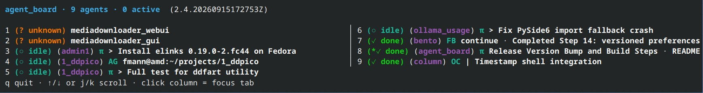
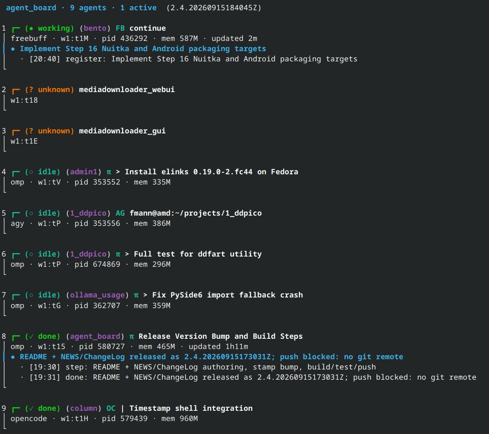

# agent_board

Watch what your coding agents are doing - in one place, live.

agent_board is a tool on top of [Herdr](https://herdr.dev) - the terminal
workspace manager for coding agents. The board reads its liveness and
status chips from herdr's session snapshot, and `agent-watch` watches the
same source; herdr must be installed and in PATH.

It is a POSIX tool: Linux is fully supported, macOS works with reduced
process discovery, and Windows is only usable inside WSL2 - see
[Platforms](#platforms).

## Live board:

```bash
agent_board view-compact
```




```bash
agent_board view
```




Two small tools live in this project (both Python 3, stdlib only):

| Tool | What it does |
|------|--------------|
| `agent_board.py` | live status board: one vertical column per agent; agents register and post what they are doing until the task is closed |
| `agent-watch` | daemon that pops a desktop notification naming the exact tab that needs input |

The implementation lives in the `src/agent_board/` package (`board.py`,
`watch.py`); the root-level `agent_board.py` file is a thin launcher shim
kept for the `~/sbin` symlink and the board systemd unit. `agent-watch`
runs `src/agent_board/watch.py` directly via the `~/sbin/agent-watch`
symlink (the old `agent_watch.py` shim is gone).

## agent_board.py

### Service

```sh
agent_board start       # install (if needed) + enable + start the service
agent_board stop        # stop + disable
agent_board restart
agent_board status      # service state + the current board frame
agent_board view        # foreground fullscreen TUI (autorefresh 30 s)
agent_board view --autorefresh 10   # TUI, refresh every 10 s
agent_board view-compact            # one line per agent, two columns
agent_board view-compact --autorefresh 10   # compact, refresh every 10 s
agent_board.py --trail              # TUI including each agent's step trail
agent_board logs [n]    # last n journal lines of the service
```

`agent_board start` runs the board as a systemd user service
(`agent_board.service` → `agent_board.py serve`): every 30 s it re-renders
the board to `~/.local/state/agent_board/board.txt` (`agent_board.py
--poll-period 2 serve` for a livelier frame file). `agent_board status` prints the
service state and that frame, so the board is readable anywhere (including
`watch -c "cat ~/.local/state/agent_board/board.txt"`).
For the interactive fullscreen TUI run `agent_board.py` or `agent_board view`
(both refresh the live data every 30 s; `--poll-period`/`--autorefresh N`
overrides, minimum 1 s).

### Columns

Each live agent gets one column:

```
┌─ (● working) (1_ddpico) fmann@amd:~/projects/1_ddpico
│ agy · w1:tP · pid 2068849 · mem 569M
```

- **Header** = the agent's herdr tab title ("project name"), captured at
  register time (spinner glyphs stripped).
- **Chip** = `● working · ❯ needs input · ■ stopped · blocked ○ idle
  ✓ done` from herdr's snapshot; `+ external` / `! stale` for cards
  outside herdr. `note input` (question/options for the user) shows the
  yellow `❯ needs input` chip; `note quota --reset <when>` shows the red
  `■ stopped` chip with a live "Resets in d hh:mm:ss" countdown - both
  clear on the agent's next step/update.
- **Tab label** = herdr's own tab label (`tabs[].label` in the snapshot),
  shown in magenta inside light-grey parens after the chip; the
  description text renders white. The tab id (`w1:tP`) stays on the meta
  line.
- **Agent badge** = cyan agent symbol. omp's `π` and opencode's `OC`/
  `OpenCode` are colored in place when the tab title starts with them;
  agents whose titles carry no symbol get one prepended (agy → `AG`,
  cline → `CL`). freebuff agents get the `FB` badge prepended.
- **Tab coverage** = every agent pane gets a column, so one herdr tab can
  show several agents side by side. A pane qualifies when herdr classified
  its agent, when a card was posted for it, or when a known agent process
  runs in its process tree (`herdr pane process-info` plus the /proc
  descendants of those foreground processes, matched by process name and by
  argv) - so cline/freebuff instances herdr did not classify still appear,
  with pid/mem, including one started inside a wrapper such as `mc` or a
  node/python launcher. A pane running several agent kinds renders one
  column per kind (`<pane>#<kind>` for the extra ones). Tabs
  without any agent get one fallback column rendered as
  `(? unknown) <tab label>` with no meta beyond the tab id, so tabs like
  `mediadownloader_webui` never vanish from the board. Agents outside
  herdr's built-in list (e.g. freebuff) can additionally be classified via
  herdr's custom-agent API -
  `herdr pane report-agent <pane> --source custom:<name> --agent <kind>
  --state working|idle|blocked` - after which they render like any other
  column, including pid/mem resolution and their `AGENT_BADGE` badge.
  Un-classified panes that merely run non-agent processes stay
  `(? unknown)` by design. Processes outside the probed tree (for example
  an agent in the background of a pane) are not found by that probe; those
  agents show up when they post a card.
- **Order** = the agents of one herdr tab stay together: the tab is placed by
  its most urgent column, its columns then follow each other, and inside a
  tab columns sort by chip priority (`working` first, `done` last) and card
  age. A column without a tab (an agent outside herdr) keeps its own place in
  that order instead of joining a group.
- **pid + mem** - resolved per agent from `/proc` (herdr's snapshot carries
  no pid): matched by agent-kind alias + cwd, external cards by their pts
  tty.
- **Text + trail** - what the agent posted: the current status line, plus
  (with `--trail`) its last steps with timestamps. Step trails are hidden
  by default so the board stays on the status lines.
- **Removal**: before every refresh the snapshot is re-read; a column
  disappears as soon as its pane is gone, and a herdr-owned card is swept
  once its pane is gone or its recorded tab is no longer an active herdr
  tab (a card whose pane herdr never classified survives while its tab
  stays open). Agents
  outside herdr post with an `ext-*` id; their column drops on
  `note stop` or after `--stale-seconds` (600).

### Agent side

| Moment | Command |
|--------|---------|
| Task start | `agent_board.py note register -m "<one-line goal>"` |
| Step started (esp. each goal.md / todo.md item) | `agent_board.py note step -m "<step>"` |
| Status materially changed | `agent_board.py note update -m "<now doing>"` |
| Finished | `agent_board.py note done -m "<one-line result>"` |
| Waiting on the user (question, options) | `agent_board.py note input -m "<question or options>"` |
| Rate/quota limit hit | `agent_board.py note quota -m "<message>" --reset "<when>"` |

Messages are one short line, user-visible. `step` also appends to the
visible trail; `update` replaces the current line only. One frame without
the TUI: `agent_board.py --once`.

For the interactive board (`agent_board view` / `agent_board view-compact`),
clicking a column focuses its herdr tab (`herdr tab focus`); every line
is numbered - type the number, Enter jumps to that tab (Esc cancels).
q or Ctrl+C quits (curses restores the terminal, exit code 0), j/k scroll.

### Tests

```sh
./_tests                        # pytest + ruff + mypy (the full gate)
./_tests --quick                # pytest only
python3 -m pytest tests/ -q     # raw pytest
```

63 tests cover text helpers, reset parsing, card storage, every `note`
action (incl. `input`/`quota` flag lifecycles), snapshot parsing (agents,
tabs, panes), the pane process probe, column building (chip priority,
sorting, several agents per tab, tab fallback, liveness sweep, refresh
glue), rendering (plain/ANSI/compact, badges incl. cline, countdowns),
help coloring, process resolution, the 30 s refresh default, and the CLI +
wrapper end-to-end in an isolated state dir. `./_tests` additionally runs
`ruff check src tests` and `mypy src/agent_board`. Run it after every
change to the package; the pre-commit hook enforces it.

### Global skill

`~/.agents/skills/agent-board/SKILL.md` teaches agents to post: register at
task start, post each step when working through goal.md / todo.md, `done`
at the end, `stop` when leaving unfinished. omp and hermes load it
automatically from `~/.agents/skills/`; any harness that can run a shell
command can post.

## agent-watch

Turn "some agent beeped" into "which tab needs you".

`agent-watch` is a small daemon that watches your coding agents and pops a
desktop notification naming the exact workspace/tab/agent that needs
attention.

### Features

- **herdr source** - polls `herdr api snapshot`; notifies when a background
  (non-focused) agent pane transitions to a needs-attention state:
  `blocked` (approval/question UI), `done` (background work finished), or
  `idle` while unfocused (ready for input).
- **external source** - finds known coding-agent processes running *outside*
  herdr (controlling tty not owned by a herdr pane) and notifies when one
  appears and its terminal goes idle. Best-effort heuristic.
- Skips the pane you are already looking at; dedupes per episode.
- Runs as a systemd user service (auto-start at login, auto-restart).

### Usage

```sh
agent-watch --once --dry-run   # print what it would notify, no popups
agent-watch --once             # one real pass (sends notifications)
agent-watch --help             # all options
```

### Options

| Option | Default | Meaning |
|--------|---------|---------|
| `--herdr-bin` | `herdr` | herdr CLI path |
| `--notify-cmd` | `notify-send` | notification command |
| `--interval` | `2.0` | herdr poll interval (s) |
| `--external-interval` | `5.0` | external scan interval (s) |
| `--idle-threshold` | `10.0` | external tty idle seconds before "needs input" |
| `--once` | off | single pass, then exit |
| `--dry-run` | off | print instead of notifying |

## Development

The project is packaged with a PEP 621 `pyproject.toml` (setuptools, src/
layout, console scripts `agent-board` / `agent-watch`) and ships the same
helper-script toolset as the other `neunmalelf` projects:

| Script | Purpose |
|--------|---------|
| `./_tests` | check suite: pytest + ruff + mypy (`--quick` skips static checks) |
| `./_run` | run the TUI / one-shot frame / note CLI from a bare checkout |
| `./_menu` | interactive helper menu (install/test/build/git/run) |
| `./_git` | interactive commit with UTC-timestamp prefix, optional push |
| `./_install` | `pip install -e .` + pre-commit hook wiring |
| `./_build` | metadata + version-stamp validation (no artifacts by design) |
| `./_docs` | build the MkDocs docs into `site/` |
| `./_check_version` | verify version stamps agree (pyproject vs package) |

A modular pre-commit hook (`hooks/pre-commit`, install once via
`bash hooks/install.sh` or `./_install`) gates every commit with version
stamps, `ruff check src tests`, `mypy src/agent_board`, and the quick test
suite; single modules can be skipped via `SKIP_<MODULE>=1`.

Versioning: `Major.Minor.YYYYMMDDhhmmssZ` (UTC timestamp stamp). The stamp
lives in `src/agent_board/board.py __version__`; `pyproject.toml [project]
version` carries the same stamp without the trailing `Z` (PEP 440 does not
allow the Z) - kept in sync by `./_check_version`. Every helper script
carries its own stamp. Released versions are tagged with that full version
string (never a bare `v2.10`) and published as GitHub releases whose notes
are the latest `history.md` entry. Project history is kept in `history.md`
(newest entry on top, doubles as release
notes) with working archives under `history/`; the rules are documented in
`.agentrules` and `docs/development.md`. `AGENTS.md` is the entry file for
coding agents.
## Layout

```
~/projects/agent_board/
├── src/agent_board/       # package: board.py (board) + watch.py (daemon)
├── agent_board.py          # launcher shim (systemd + ~/sbin entry)
├── agent_board             # service manager (start/stop/status/view)
├── _build _check_version _docs _git _install _menu _run _tests
├── hooks/                  # modular pre-commit hook + installer
├── history.md              # release log (newest entry on top)
├── history/                # archives: prompts/ changes/ todo/ plans/ tests/ ideas/ goals/
├── docs/  mkdocs.yml       # MkDocs sources + config (built into site/)
├── man/  tldr/  systemd/  skills/  tests/
└── AGENTS.md  .agentrules  LICENSE  pyproject.toml
```

`~/sbin/agent_board.py`, `~/sbin/agent-watch` and `~/sbin/agent_board` are
symlinks into this directory.

## Platforms

Linux is the supported platform - the systemd service install and the
packaging classifiers assume it. macOS and Windows run partially:

- **Linux** - fully supported. Needs Python 3.13+, `herdr` in PATH, and
  `pgrep` (procps); `notify-send` for agent-watch desktop notifications.
- **macOS** - partial. The `note` CLI, the curses TUI, and the JSON card
  files work, but there is no `/proc`, so pid/mem resolution and
  external-tty discovery find nothing (columns render without pid, and
  agent-watch's external source stays silent). There is no systemd:
  run `agent_board.py serve` directly (nohup/launchd) instead of the
  user units.
- **Windows** - not supported natively: `curses` is not part of Windows
  CPython, and `/proc`, `pgrep`, `notify-send`, systemd, and `herdr` are
  POSIX-only. Run the tools inside **WSL2** with systemd enabled
  (`/etc/wsl.conf` `[boot] systemd=true`) - there they behave like on
  Linux, including the service install below.

## Install (fresh machine)

```sh
# 1. Put the project somewhere (here: ~/projects/agent_board)
# 2. Symlink the binaries
ln -s ~/projects/agent_board/agent_board.py ~/sbin/agent_board.py
ln -s ~/projects/agent_board/src/agent_board/watch.py ~/sbin/agent-watch
ln -s ~/projects/agent_board/agent_board ~/sbin/agent_board

# 3. Install the services
mkdir -p ~/.config/systemd/user
cp ~/projects/agent_board/systemd/*.service ~/.config/systemd/user/
systemctl --user daemon-reload
systemctl --user enable --now agent_board.service agent-watch.service

# 4. Install the global posting skill
mkdir -p ~/.agents/skills
cp -r ~/projects/agent_board/skills/agent-board ~/.agents/skills/

# (optional, devs) editable install with console scripts + git hook:
~/projects/agent_board/_install
```

Requirements: Python 3.13+, `herdr` in PATH, `notify-send` (for
agent-watch). Dev checks additionally need `ruff`, `mypy`, `pytest` -
`python3 -m pip install -e ".[dev]"`.

### man + tldr pages (optional, Linux)

```sh
# man pages - the watcher page installs under its .SH NAME (agent-watch):
install -D man/agent_board.1   ~/.local/share/man/man1/agent_board.1
install -D man/agent-watcher.1 ~/.local/share/man/man1/agent-watch.1
mandb

# tldr pages - copy into your tldr client's custom page dir
# (tldr-python-client example below; tealdeer uses ~/.local/share/tealdeer/pages):
mkdir -p ~/.local/share/tldr/pages/custom
cp tldr/agent_board.md    ~/.local/share/tldr/pages/custom/agent_board.md
cp tldr/agent-watcher.md  ~/.local/share/tldr/pages/custom/agent-watcher.md
```
Afterwards `man agent-board`, `man agent-watch`, and
`tldr agent_board` / `tldr agent-watcher` resolve locally.

## Managing the services

```sh
~/sbin/agent_board status                    # board: state + live frame
systemctl --user status agent_board agent_watch
journalctl --user -u agent_board -f          # follow board writer log
systemctl --user restart agent-watch         # after editing the watcher
```

## Uninstall

```sh
~/sbin/agent_board stop
systemctl --user disable --now agent-watch.service
rm ~/.config/systemd/user/agent_board.service ~/.config/systemd/user/agent-watch.service
rm ~/sbin/agent_board.py ~/sbin/agent-watch ~/sbin/agent_board
rm -rf ~/projects/agent_board
```

## Notes / limitations

- pid + mem resolution is best-effort: it matches agent-kind aliases + cwd
  (herdr agents) or the pts tty (external cards); a column may show without
  pid if the process cannot be identified confidently.
- The external "needs input" heuristic in agent-watch (tty idle) is
  best-effort; the *detection* of external agents is validated.
- herdr's own `[ui.toast] delivery = "system"` and `status_indicators` +
  `show_agent_labels_on_pane_borders` complement these tools; see
  `~/.config/herdr/config.toml`.
